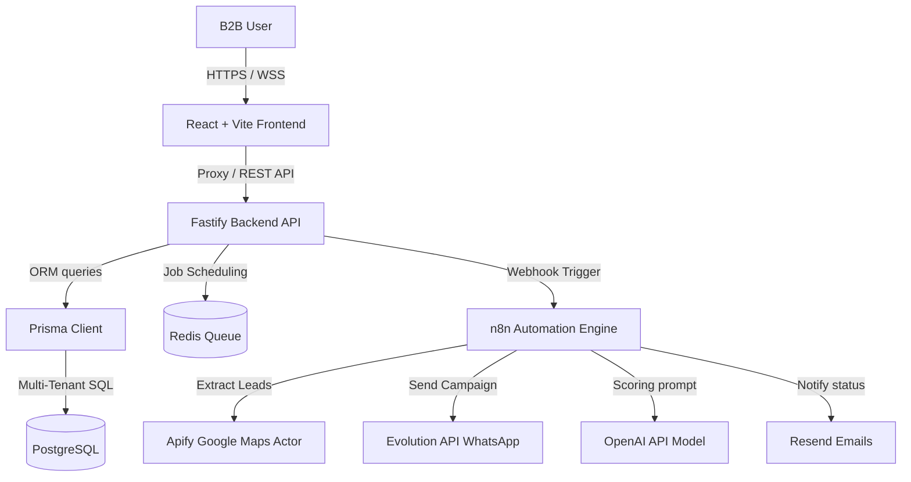

# LeadForge AI - Software Architecture

This document describes the software architecture of the **LeadForge AI** platform, designed from the ground up as a B2B SaaS platform.

## Architecture Model

## Core Layout

1. **Frontend (apps/web)**:
   - Built with **React**, **Vite**, and **TypeScript**.
   - Custom **Tailwind CSS** tokens matching the high-end dark slate & cyan palette.
   - SPA navigation for: Dashboard metrics, Prospects list, AI Analyst scoring, WhatsApp QR pairing, Agents configurations, and n8n Workflows.
   
2. **Backend API (apps/api)**:
   - Built on **Fastify** for near-zero routing overhead.
   - JWT validation mapping individual credentials to a specific `companyId` (tenant partition).
   - In-memory database fallback to ensure zero setup friction for developer reviews.

3. **Prisma Database Layer (packages/database)**:
   - Schema featuring: `Company`, `User`, `Prospect`, `WhatsappInstance`, `Agent`, `Workflow`.
   - Pre-configured relationships ensuring all prospect records and agent rules cannot leak across organizations.

4. **AI & Integrations (packages/ai & packages/integrations)**:
   - Dynamic prompt constructor for GPT scoring.
   - Direct bindings to Evolution API for WhatsApp QR code generation, keeping sessions persistent.
