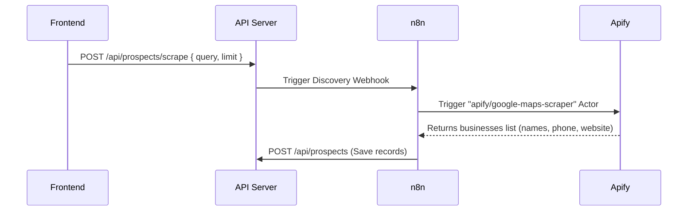

# LeadForge AI - n8n Workflows Design

This document details the n8n automation scenarios configured to handle background operations for LeadForge AI.

---

## 1. Lead Discovery (Google Maps Scraper)
Triggered from the frontend to fetch local businesses from Google Maps.

---

## 2. Enrichment & AI Scoring
Runs automatically when a new prospect is added to qualify its sales feasibility.

1. **Webhook Trigger**: Fired by database changes when a prospect status is `NEW`.
2. **OpenAI Scorer Node**: Evaluates website contents, detects commercial problems, suggests answers, and outputs a quality score (0-100).
3. **Database Sync**: Updates the prospect's `score` and creates a hot `Opportunity` if the score is greater than 80.

---

## 3. WhatsApp Follow-up Campaign
Sends automated messages to qualified opportunities.

1. **Trigger**: n8n Cron schedule (e.g. daily at 10:00 AM).
2. **Fetch qualified leads**: Retrieves prospects with status `QUALIFIED` and score > 80.
3. **Dispatch message**: Calls Evolution API endpoint `https://evolution.leadforge.ai/message/sendText` to send the AI-generated message.
4. **Log run**: Records workflow status log inside LeadForge database.
